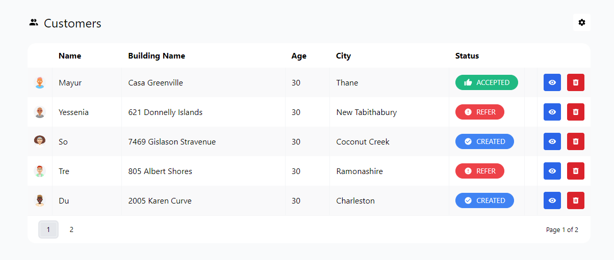
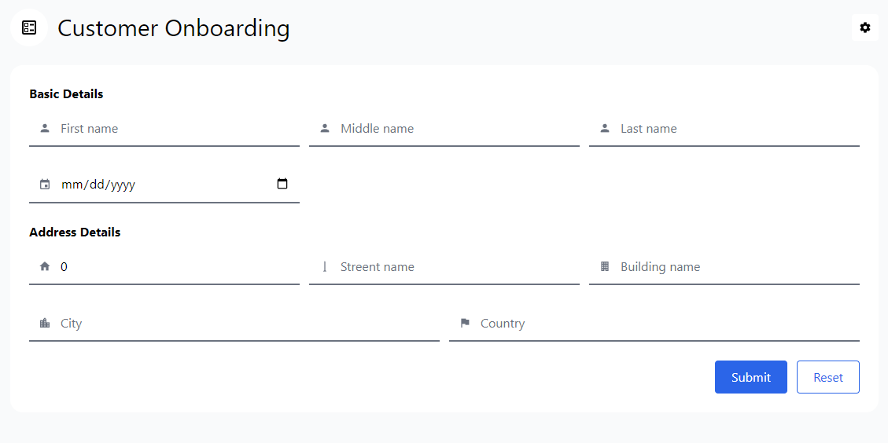

# bank-api

### Swagger specification file
`api-specification/bank-api-specification.yml`

### CHANGE LOG 

| Date     | Issue Id                                       | Changes done                        | Result                                                                  |
|----------|------------------------------------------------|-------------------------------------|-------------------------------------------------------------------------|
| 9/4/2023 | https://github.com/mayur-ravindram/bank/issues | Created apis for CRUD functionality |  |
|          |                                                |                                     |                                                                         |