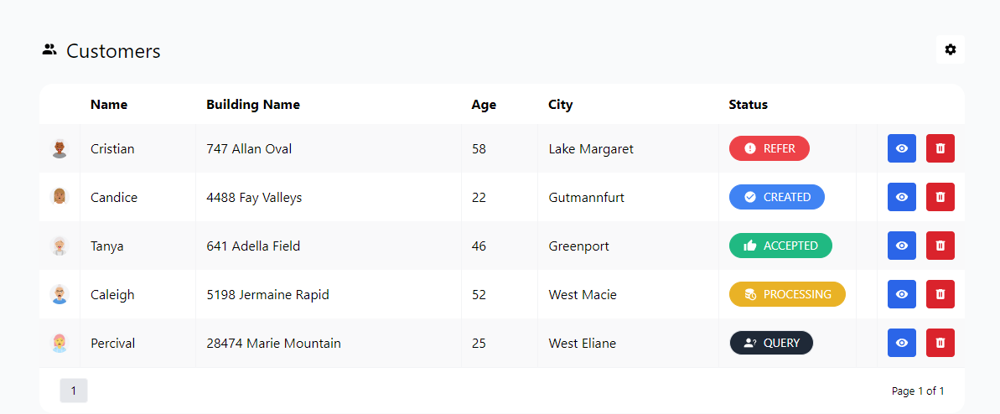

# bank-api

### Swagger specification file
`api-specification/bank-api-specification.yml`

### CHANGE LOG 

| Date      | Issue Id                                         | Changes done                        | Result                                                                  |
|-----------|--------------------------------------------------|-------------------------------------|-------------------------------------------------------------------------|
| 9/4/2023  | https://github.com/mayur-ravindram/bank/issues/2 | Created apis for CRUD functionality |  |
|           |                                                  |                                     |                                                                         |
| 9/14/2023 | https://github.com/mayur-ravindram/bank/issues/4 | Account opening status changes      |                                    |